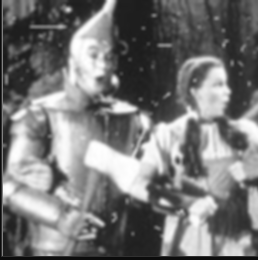
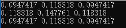
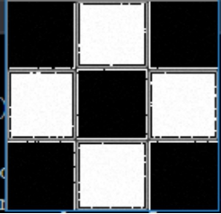
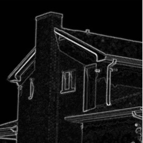

#   数字图像处理报告

## 摘要：

  本文将利用VS平台和c++ 以及Opencv开源库基于空域滤波对图像进行一系列操作，如用高斯滤波器和中值滤波器去平滑图像，利用固定方差 sigma=1.5产生高斯滤波器对图像进行处理，利用高通滤波器滤波测试图像。

## 题目一：利用高斯和中值滤波平滑图像

### 一.高斯滤波简介

高斯滤波(Gauss filter)实质上是一种信号的滤波器，其用途为信号的平滑处理，数字图像用于后期应用，其噪声是最大的问题，因为误差会累计传递等原因，大多图像处理教材会在很早的时候介绍Gauss滤波器，用于得到信噪比SNR较高的图像（反应真实信号）。高斯平滑滤波器对于抑制服从正态分布的噪声非常有效。【1】  

#### 1.二维高斯分布：

 

 

根据这个公式，我们有个高斯滤波模板公式：


#### 2.高斯滤波的性质：

高斯函数具有五个重要的性质，这些性质使得它在早期图像处理中特别有用．这些性质表明，高斯平滑滤波器无论在空间域还是在频率域都是十分有效的低通滤波器，且在实际图像处理中得到了工程人员的有效使用．高斯函数具有五个十分重要的性质，它们是：  　　

（1）二维高斯函数具有旋转对称性，即滤波器在各个方向上的平滑程度是相同的．一般来说，一幅图像的边缘方向是事先不知道的，因此，在滤波前是无法确定一个方向上比另一方向上需要更多的平滑．旋转对称性意味着高斯平滑滤波器在后续边缘检测中不会偏向任一方向．  　　

（2）高斯函数是单值函数．这表明，高斯滤波器用像素邻域的加权均值来代替该点的像素值，而每一邻域像素点权值是随该点与中心点的距离单调增减的．这一性质是很重要的，因为边缘是一种图像局部特征，如果平滑运算对离算子中心很远的像素点仍然有很大作用，则平滑运算会使图像失真．  　　

（3）高斯函数的傅立叶变换频谱是单瓣的．正如下面所示，这一性质是高斯函数付立叶变换等于高斯函数本身这一事实的直接推论．图像常被不希望的高频信号所污染(噪声和细纹理)．而所希望的图像特征（如边缘），既含有低频分量，又含有高频分量．高斯函数付立叶变换的单瓣意味着平滑图像不会被不需要的高频信号所污染，同时保留了大部分所需信号．  　　

（4）高斯滤波器宽度(决定着平滑程度)是由参数σ表征的，而且σ和平滑程度的关系是非常简单的．σ越大，高斯滤波器的频带就越宽，平滑程度就越好．通过调节平滑程度参数σ，可在图像特征过分模糊(过平滑)与平滑图像中由于噪声和细纹理所引起的过多的不希望突变量(欠平滑)之间取得折衷．

（5）由于高斯函数的可分离性，较大尺寸的高斯滤波器可以得以有效地实现．二维高斯函数卷积可以分两步来进行，首先将图像与一维高斯函数进行卷积，然后将卷积结果与方向垂直的相同一维高斯函数卷积．因此，二维高斯滤波的计算量随滤波模板宽度成线性增长而不是成平方增长．  

### 二.中值滤波简介

中值滤波是基于排序统计理论的一种能有效抑制噪声的非线性信号处理技术，中值滤波的基本原理是把数字图像或数字序列中一点的值用该点的一个邻域中各点值的中值代替，让周围的像素值接近的真实值，从而消除孤立的噪声点。方法是用某种结构的二维滑动模板，将板内像素按照像素值的大小进行排序，生成单调上升（或下降）的为二维数据序列。二维中值滤波输出为g（x,y）=med{f(x-k,y-l),(k,l∈W)} ，其中，f(x,y)，g(x,y)分别为原始图像和处理后图像。W为二维模板，通常为3*3，5*5区域，也可以是不同的的形状，如线状，圆形，十字形，圆环形等。【2】

###  三.结果对比

从左到右分别是3,5,7的大小

test1高斯滤波（方差为1.5）



test1中值滤波


test2高斯滤波（方差为1.5）


test2中值滤波


### 四.结果分析

我们可以看到高斯滤波在处理脉冲噪音方面不如中值滤波，中值滤波在模板为5x5时已经可以将噪音滤去。

而在图像细节保留方面，高斯滤波更有优势，不会出现类似于水墨画一般的图像。

## 题目二：产生固定方差为1.5的高斯滤波

### 一.结果：




## 题目三：图像锐化

### 一.unsharp masking

#### 1.原理：

1.模糊原图像 f(x,y)->s(x,y)。

2.从原图像中减去模糊图像，产生的差值图像称为模板：Gm(x,y)=f(x,y)-s(x,y);

3.将模板加到原图像中：G(x,y)=f(x,y) + k*Gm(x,y)

这里的k(k>=0)取值有三种可能：

当K=1时，为非锐化掩蔽

当k>1时，高提升滤波，系数越大对细节的增强越明显。

当k<1时，不强调非锐化模板的贡献

系数k越大对细节增强越明显;平滑减弱的边缘，锐化后增强的更加明显。

#### 2.结果：



#### 3.分析：

​    一般锐化模板其系数之和均为0，这说明算子在灰度恒定区域的响应为0，即在锐化处理后的图像中，原图像的平滑区域近乎黑色，而原图中所有的边缘、细节和灰度跳变点都作为黑背景中的高灰度部分突出显示。基于锐化的图像增强中存储希望在增强边缘和细节的同时仍然保留原图像中的信息，而非将平滑区域的灰度信息丢失，因此可以把原图像加上锐化后的图像得到比较理想的结果。

### 二. Sobel edge detector

#### 1.原理：

 

#### 2.结果：




#### 3.分析：

利用Sobel算子进行边缘检测会去除灰度不变或者变换缓慢的区域，从而凸显出其边缘，但是由于其算法的特性，因为只计算两个方向的导数，对于纹理复杂的图像，其边缘检测便不是特别有效，同时，该算法认为：凡灰度新值大于或等于阈值的像素点时都是边缘点。这种判断欠合理，会造成边缘点的误判，因为许多噪声点的灰度值也很大。 

### 三.Laplace edge detection

#### 1.Laplace算子简介

 如果图像灰度变化剧烈，进行一阶微分则会形成一个局部的极值，由数学上的知识，对图像进行二阶微分则会形成一个过零点，并且在零点两边产生一个波峰和波谷，我们要设定一个阈值，检测到这个过零点，如下图所示： 

 

拉普拉斯算子是最简单的各向同性微分算子，它具有旋转不变性。一个二维图像函数的拉普拉斯变换是各向同性的二阶导数，定义为：  

为了适合图像处理我们有： 

#### 2.处理结果


#### 3.分析

可见拉普拉斯算子降低了整个图片的亮度值，适用于以突出图像中的孤立点、孤立线或线端点为目的的场合 。同时和sobel算子一样，其对噪声同样敏感。在使用之前要进行平滑处理。

### 四.Canny algorithm

#### 1.Canny边缘检测基本原理

Canny 的目标是找到一个最优的[边缘检测](https://baike.baidu.com/item/%E8%BE%B9%E7%BC%98%E6%A3%80%E6%B5%8B)算法，最优边缘检测的含义是：

(1)最优检测：算法能够尽可能多地标识出图像中的实际边缘，漏检真实边缘的概率和误检非边缘的概率都尽可能小；

(2)最优定位准则：检测到的边缘点的位置距离实际边缘点的位置最近，或者是由于噪声影响引起检测出的边缘偏离物体的真实边缘的程度最小；

(3)检测点与边缘点一一对应：算子检测的边缘点与实际边缘点应该是一一对应。

Canny边缘检测算法可以分为以下5个步骤：

1）应用高斯滤波来平滑图像，目的是去除噪声。

2）找寻图像的强度梯度（intensity gradients）。

3）非最大抑制（non-maximum suppression）技术来消除边误检（本来不是但检测出来是）。

4）应用双阈值的方法来决定可能的（潜在的）边界。

5）利用滞后技术来跟踪边界。

#### 2.处理结果


#### 3.分析

可见，canny算法对像素灰度的变换十分敏感，检测出了sobel和lacplace都没检测出的边缘，但是由于其算法特点，阈值设置不同，处理效果也不同，要多次试验阈值才能达到较好的效果。


## 附录：

### 参考文献：

1.高斯滤波  百度百科（https://baike.baidu.com/item/%E9%AB%98%E6%96%AF%E6%BB%A4%E6%B3%A2/9032353?fr=aladdin）

2.中值滤波 百度百科 （https://baike.baidu.com/item/%E4%B8%AD%E5%80%BC%E6%BB%A4%E6%B3%A2/5031069）

### 代码：

```
#include "stdafx.h"
#include<opencv2/opencv.hpp>
#include<opencv2/highgui/highgui.hpp>
#include<math.h>
#include<string>
#include<iostream>
#include<vector>
#include "opencv2/stitching.hpp"
#include<time.h>
using namespace cv;
using namespace std;

//高斯滤波及1.5高斯滤波的模板求解
int main()
{
	Mat src = imread("C:\\Users\\Lenovo\\Desktop\\test2.tif");
	Mat gray;
	Mat GAUSS;
	Mat MED;
	double arr[3][3];
	double sum = 0.0;
	double sigma = 1.5;
	cvtColor(src, gray, CV_BGR2GRAY);
	GaussianBlur(gray, GAUSS, Size(7, 7),1.5 , 1.5);
	medianBlur(gray, MED,3);
	//3x3 1.5 高斯
	for (int i = 0; i < 3; ++i)
		for (int j = 0; j < 3; ++j)
			sum += arr[i][j] = exp(-((i - 1)*(i - 1) + (j - 1)*(j - 1)) / (2 * sigma*sigma));
	for (int i = 0; i < 3; ++i)
		for (int j = 0; j < 3; ++j)
			arr[i][j] /= sum;
	for (int i = 0; i < 3; ++i) {
		for (int j = 0; j < 3; ++j)
			cout << arr[i][j] << " ";
		cout << endl;
	}
	imshow("piu", GAUSS);
	imshow("piup", MED);
	cvWaitKey();

}
//gauss1.5

int main()
{
	Mat src = imread("C:\\Users\\Lenovo\\Desktop\\test1.pgm");
	Mat gray;
	Mat GAUSS;
	cvtColor(src, gray, CV_BGR2GRAY);
	GaussianBlur(gray, GAUSS, Size(3, 3), 1.5, 1.5);
	imshow("piu", GAUSS);
	cvWaitKey();

}
//边缘检测

int main()
{
	Mat sobel(Mat p);
	Mat unsharpMasking(Mat p, double c);
	Mat src = imread("C:\\Users\\Lenovo\\Desktop\\test3.pgm");
	Mat gray;
	Mat dst;
	Mat dst1;
	Mat dst2;
	Mat dst3;
	Mat laplace;
	cvtColor(src, gray, CV_BGR2GRAY);
	dst = unsharpMasking(gray, 0.3);
	dst1 = sobel(gray);
	Laplacian(gray, laplace, CV_16S, 3, 1, 0, BORDER_DEFAULT);
	convertScaleAbs(laplace, dst2);
	Canny(gray, dst3, 50, 100);
	imshow("piu", dst3);
	cvWaitKey();


}

Mat unsharpMasking(Mat p, double c)
{

	Mat smooth;
	Mat result;
	result = p.clone();
	GaussianBlur(p, smooth, Size(3, 3), 0,0);
	for (int i = 0; i < p.rows; i++)
	{
		for (int j = 0; j < p.cols; j++)
		{
			result.at<uchar>(i, j) = p.at<uchar>(i, j) + c * (p.at<uchar>(i, j) - smooth.at<uchar>(i, j));
		}
	}

	return result;
}
Mat sobel(Mat p)
{
	Mat smooth;
	Mat result;
	result = p.clone();
	GaussianBlur(p, smooth, Size(3, 3), 0, 0);
	Mat grad_x, grad_y;
	Mat abs_grad_x, abs_grad_y, dst;
	Sobel(p, grad_x, CV_16S, 1, 0, 3, 1, 1, BORDER_DEFAULT);
	convertScaleAbs(grad_x, abs_grad_x);
	Sobel(p, grad_y, CV_16S, 0, 1, 3, 1, 1, BORDER_DEFAULT);
	convertScaleAbs(grad_y, abs_grad_y);
	addWeighted(abs_grad_x, 0.5, abs_grad_y, 0.5, 0, result);
	return result;


}


```

